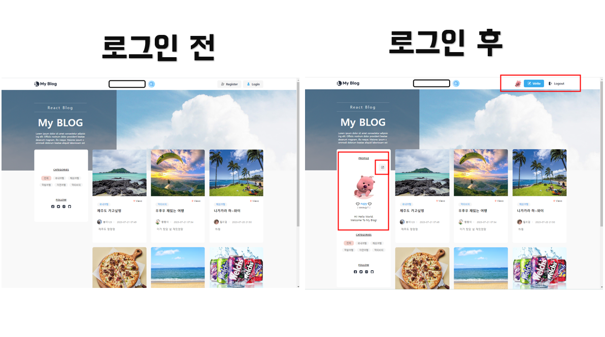
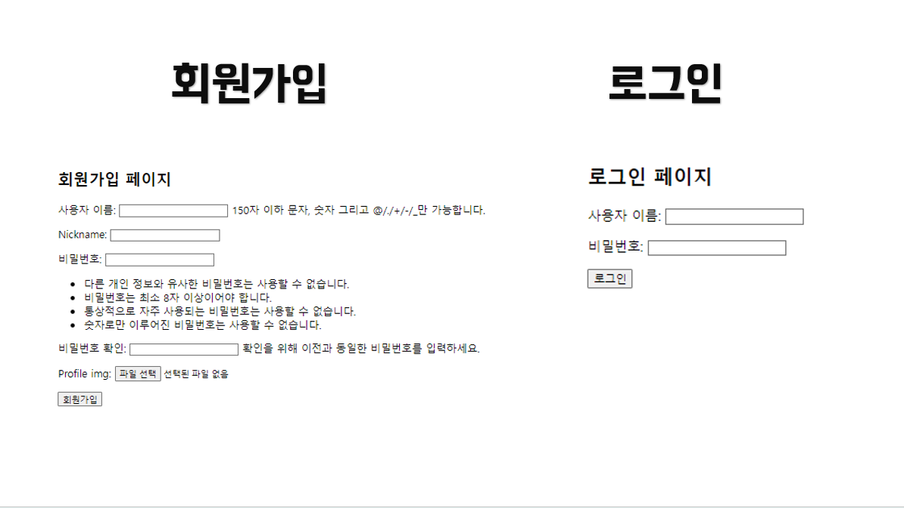
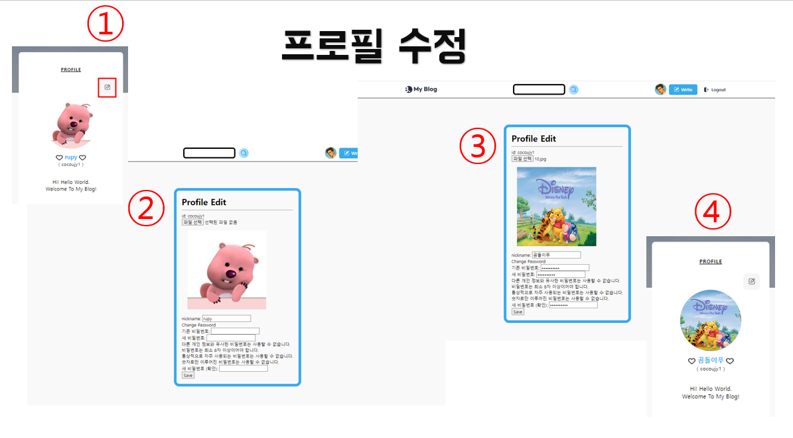
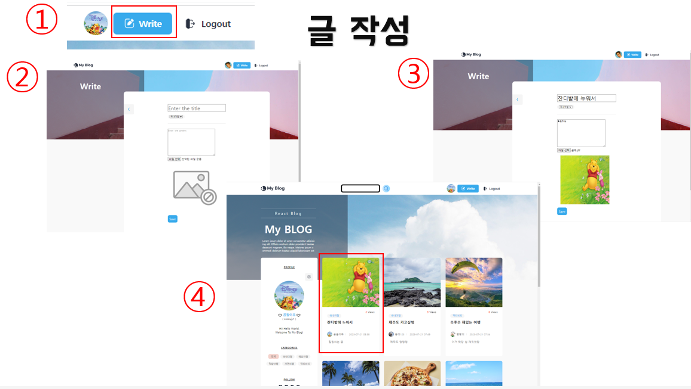
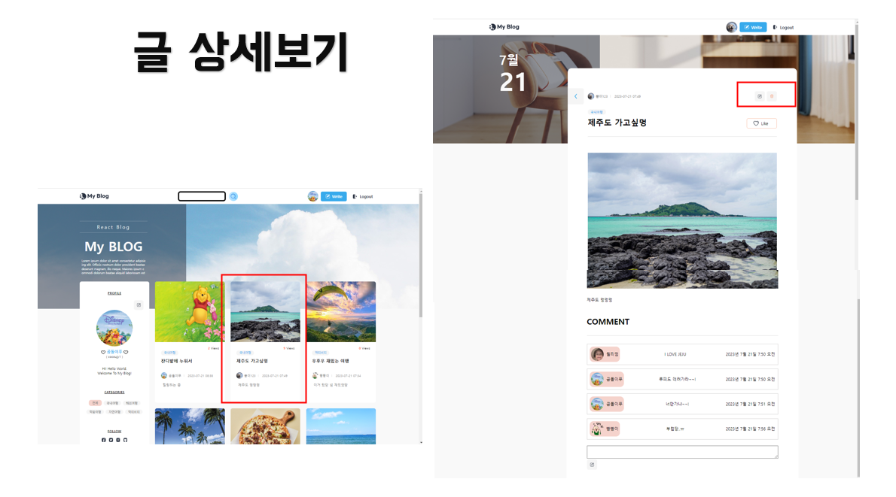
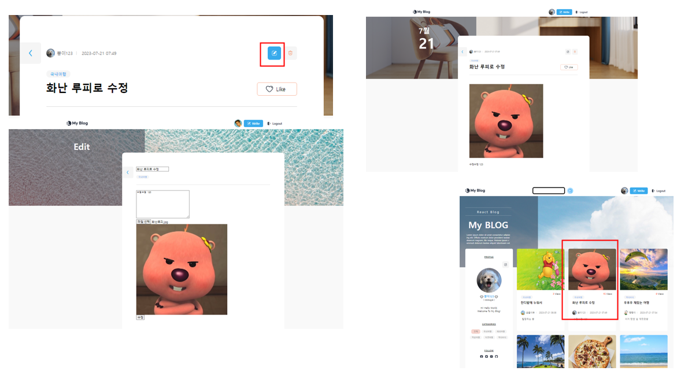
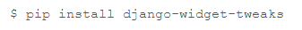
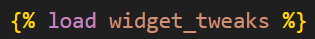
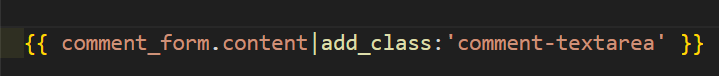

# Django Travel-Blog


## 1. 목표와 기능

### 1.1 목표
- Django와 친숙해지기

### 1.2 기능
- 게시글 관련
  - 게시글 목록
  - 게시글 상세보기
  - 게시글 작성 (이미지 업로드 가능)
  - 게시글 수정
  - 게시글 삭제
  - 게시글 검색
  - 카테고리 별 게시글 조회
  - 게시글 조회수
  - 댓글 조회
  - 댓글 작성
  - 댓글 삭제

- 유저 관련
  - 회원가입 (프로필 사진 설정 가능)
  - 로그인
  - 로그아웃
  - 프로필 수정 (닉네임, 비밀번호, 프로필 사진)

## 2. 개발 환경 및 배포 URL

### 2.1 개발 환경

- Front-end
  - HTML
  - JavaScript
  - CSS
- Back-end
  - Python
  - Django


### 2.2 배포 URL


## 3. 프로젝트 구조와 개발 일정

### 3.1 프로젝트 구조

```bash

```

### 3.1 개발 일정(WBS)


## 4. 역할 분담

- 모든 역할과 작업은 개인이 수행함

## 5. UI / BM

- 메인페이지


- 회원가입 / 로그인


- 프로필 수정


- 글 작성


- 글 상세보기


- 글 수정


... 추가예정

## 6. 메인 기능


## 7. 개발하며 느낀점
- 프로필 수정부분에서 닉네임, 프로필사진, 비밀번호를 한 번에 수정시키려다보니 닉네임은 수정되는데 비밀번호는 수정 안되고 그 반대로 비밀번호는 수정되는데 닉네임은 수정 안되는 오류가 발생하였습니다. -> PasswordChangeForm 이용하여 비밀번호 변경 폼 따로 이용해서 수정
- 이미지 기능 구현 위한 과정 중 Pillow를 설치가 안되었습니다. -> 강사님께 여쭤봐서 해결 중 파이썬이 32bit 버전이었던 걸 알게되었고 낮은 버전으로 설치
- 이미 만들어 진 UI를 수정하려다보니 제가 짠 코드가 아니므로 UI 수정시 어디를 수정하면 그 큰 다른 부분이 바뀌고 그래서 좀 UI 부분에서도 마음대로 잘 되지 않아서 힘든 부분이 있었습니다.
- 자바 스프링을 배웠었는데 스프링 프로젝트를 하면서 과거에 많이 좌절했어서 장고는 잘 할 수 있을까 걱정하고 시작했는데 스프링과 다르게 어려운데 정말 재밌고 유연하다는 생각이 들었습니다.<br>
또한 장고가 제공하는 기능이 정말 많아서 하나씩 알게될수록 새로웠습니다. 예를 들어,
템플릿 문법을 사용해서 태그를 만들때 css class주기 <br>
 ->  -> 
- 기능을 추가하여 더욱 고도화 시키고 파일들을 깔끔하게 정리할 예정입니다. 
또한 오류 내용과 프로젝트 내용들을 추가해서 잘 정리를 해두어야겠습니다.
